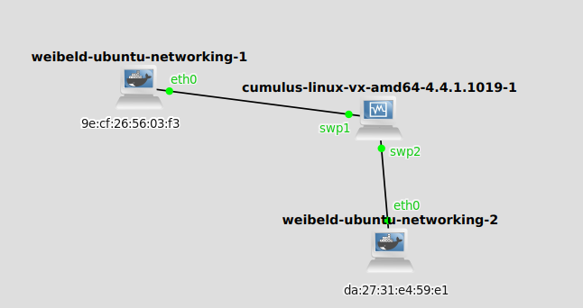

# Note nell'esecuzione del laboratorio

## Infrastruttura
Si usano container per maggior risparmio di risorse per i nodi, mentre la VM di cumulus per lo switch.




## Comandi
<table border="0">
 <tr> <td>

```
ip link add link enp0s3 macsec0 type macsec
ip macsec add macsec0 tx sa 0 pn 1 on key 01 \
	09876543210987654321098765432109
ip macsec add macsec0 rx address \
	da:27:31:e4:59:e1 port 1
ip macsec add macsec0 rx address \
	da:27:31:e4:59:e1 port 1 sa 0 pn 1 \
	on key 02 12345678901234567890123456789012
ip link set dev macsec0 up
ip addr add 10.100.0.1/24 dev macsec0
```

*commands on docker-1*
</td><td>

```
ip link add link enp0s3 macsec0 type macsec
ip macsec add macsec0 tx sa 0 pn 1 on key 02 \
	12345678901234567890123456789012
ip macsec add macsec0 rx \
	address 9e:cf:26:56:03:f3 port 1
ip macsec add macsec0 rx \
	address 9e:cf:26:56:03:f3 port 1 sa 0 \
pn 1 on key 01 09876543210987654321098765432109
ip link set dev macsec0 up
ip addr add 10.100.0.3/24 dev macsec0
```
*commands on docker-2*
</td>
 </tr>
</table>

Questo lab è eseguito dopo il [lab02 sulle ACL](https://github.com/lucaMastro/NSD-labs/tree/main/lab02-ACL), per cui sono ancora installate le regole per il filtraggio dei pacchetti in funzione dei MAC address. Per far comunicare le macchine, quindi, si sono commentate tutte le regole nel file `/etc/cumulus/acl/policy.d/nsd.rules` e si sono poi installate con `sudo cl-acltool -i`.
