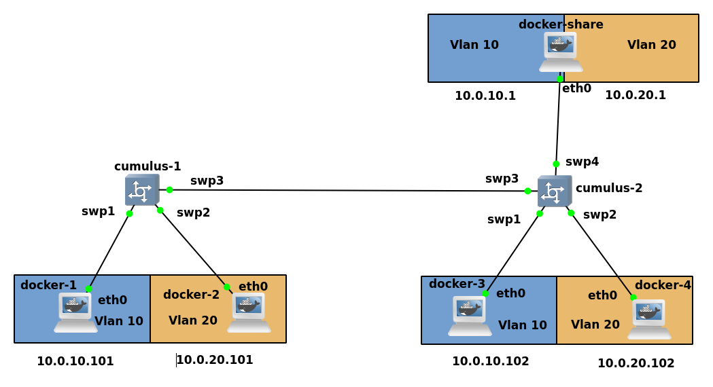

# Note nell'esecuzione del laboratorio

## Infrastruttura
Si usano container per maggior risparmio di risorse per i nodi, mentre la VM di cumulus per lo switch.




## Comandi
<table border="0">
 <tr> 
<td>

**docker-X, with `X = 1` for docker-1 and `X = 2` for docker-3**
```
ip a a 10.0.10.10X/24 dev eth0
ip a r default via 10.0.10.1 
```

</td>
<td>

**docker-X, with `X = 1` for docker-2 and `X = 2` for docker-4**
```
ip a a 10.0.20.10X/24 dev eth0
ip a r default via 10.0.20.1 
```
</td>
 </tr>
 
 <tr>
<td>
	
**cumulus-1**
```
net del all
net commit
net add bridge bridge ports swp1,swp2,swp3
net add bridge bridge pvid 1
net add bridge bridge vids 10,20
net add interface swp1 bridge access 10
net add interface swp2 bridge access 20
net commit
```
</td>
<td>

**cumulus-2**
```
net del all
net commit
net add bridge bridge ports swp1,swp2,swp3,swp4
net add bridge bridge pvid 1
net add bridge bridge vids 10,20
net add interface swp1 bridge access 10
net add interface swp2 bridge access 20
net commit
```
</td>
 </tr>

 <tr>

<td colspan=2>

**docker-share**
```
sysctl -w net.ipv4.ip_forward=1
ip link add link eth0 name eth0.10 type vlan id 10
ip link add link eth0 name eth0.20 type vlan id 20
ip l s eth0.10 up
ip l s eth0.20 up
ip a a 10.0.10.1/24 dev eth0.10
ip a a 10.0.20.1/24 dev eth0.20
ip a

```

</td>
 </tr>
</table>

Il container `docker-share` funge da router esterno per entrambe le vlan: in questo modo è possibile far comunicare nodi di vlan diverse. 
